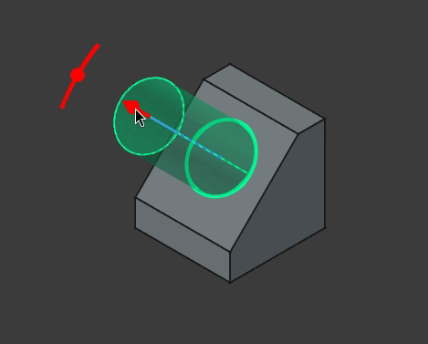
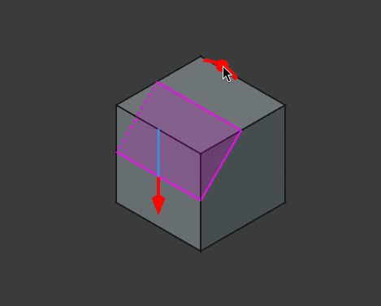

# GSoC Report
## Introduction
After a three month long thrilling experience finally the GSoC project "Interactive controls in the 3D View" is almost at an end. A lot of interesting things and aspects were explored during this period. The following sections tries to briefly document what was accomplished and what will be coming in the future.

## The Journey
The preparations for the project was started from the community bonding period. This phase was utilized for interacting with the community to understand their expectations and desires from this project. Different commercial and open-source CAD packages were explored to evaluate how different problems associated with this project are tackled by them. Apart from this different mathematical concepts and software APIs like NURBS, bezier-curves, Open Cascade Technology (CAD kernel used by FreeCAD), coin3d (graphics library used by FreeCAD for drawing geometry), Qt, etc were studied during this period. Experienced and professional CAD users were approached to know about their experience with interactive controls from other software. Thus, by accumulating all the data a rough roadmap was prepared for the coding period.

The initial weeks of the coding period was spent in refactoring the existing controls in FreeCAD. The draggers were partially rewritten so that they can be used independently and utilized for use cases other than the transform tool. They were made much more customizable enabling adding different kinds of shapes and geometries for the draggers a lot easier. Also, thorough theming options has been added which allows customizing the colors of the different components of the interactive controls through the UI editor in the preferences menu.

The next phase of the project involved implementing the draggers for different operations from the PartDesign workbench of FreeCAD. Using the previously prepared prototype as a reference, first the extrude based operations i.e the Pad and Pocket operations were covered. Next, the other operations with linear properties like Fillet, Chamfer, Thickness and Helix got the draggers. After that the focus was shifted to operations with angular properties like Revolution and Groove. Most of the work in this phase required interacting with the underlying OCCT kernel to calculate and determine the appropriate position and orientations of the draggers.

After completing the previous phase, some time was spent to gather feedback from the users and the Design-Working-Group. Based on the feedback the interactive controls were refined and bugs were fixed. The draggers for some of the operations were refactored to use better and potentially faster logic. For example, to calculate the position of the dragger for Pad, first it is checked if the profile is a primitive, if not then the two NURBS parameters are used to calculate the midpoint. The center of gravity is used only as a last resort when everything else fails. Also, each of the operations were revisited to add some functionality that was left during the first iteration like support for custom direction in Pad and Pocket and more modes for Chamfer. Some of the previously left operations like Hole and a few of the primitives (Box, Cylinder and Sphere) were covered.

Draggers for the thickness operation from the Part workbench was covered as a proof that the interactive controls can be easily extended to other workbenches as well. Though, it is kept disabled for the time being to avoid an inconsistent experience. The reason for choosing the Thickness operation was that, as of now it is one of the few operations in the Part workbench where the geometry of the body is recomputed instantly with a change in the property, which is very important for the draggers to work.

Even though not planned initially, dimensional visualizers were added to most of the operations along with the draggers. They are often very useful in visualizing the extent of the operation and determining a rough estimate of the value. While the current implementation is quite simplistic, still they can be very useful when combined with the transparent previews and the draggers. Also, advanced users might use them to determine the value beyond which a operation is failing or turn off instant recomputes to avoid performance issues with complex bodies during modeling.

The last phase of the project was spent on implementing the on-view-parameters (OVPs) for the draggers. The OVPs are basically small text boxes that stay close to the draggers in the 3D view and aid the user to quickly inspect the values being edited by the draggers. One can also use them to quickly edit the values without needing to access the task panel. While the draggers are really good for rough adjustments they are not so useful for precise adjustments. In such cases the OVPs are invaluable.

Sadly, while the draggers and the dimension visualizers for most of the operations were merged for the upcoming 1.1 release, the OVPs and the interactive controls for the primitive operations didn't make it. The draggers for the primitives were slightly late and in case of the OVPs they need more polishing plus there is some uncertainty regarding how they should be integrated into FreeCAD without cluttering the 3D view. Hopefully, these features will be available in the 1.2 release. Also for the time being, the interactive draggers are missing for the Draft operation as implementing them will need slight modifications in the feature itself.

## TL;Dr
* Draggers were added for the following operations in PartDesign:
	- [X] Pad
	- [x] Revolution
	- [X] Additive Loft (Not required)
	- [X] Additive Pipe (Not required)
	- [X] Additive Helix
	- [X] Additive primitives (Only for Box, Cylinder and Sphere) [Not merged]
	- [X] Pocket
	- [x] Groove
	- [x] Hole
	- [X] Subtractive Loft (Not required)
	- [X] Subtractive Pipe (Not required)
	- [X] Subtractive Helix
	- [X] Subtractive primitives (Only for Box, Cylinder and Sphere) [Not merged]
	- [X] Fillet
	- [X] Chamfer
	- [ ] Draft
	- [X] Thickness
* Created proper interfaces and abstractions for the draggers.
* Created dimension visualizers to aid the interactive controls.
* Revamped existing dragger classes.
* Implemented the draggers for the Thickness operation in Part workbench as a proof of concept.
* Added OVPs for the properties that have draggers. [WIP, not merged]

List of [PRs](https://github.com/FreeCAD/FreeCAD/pulls?q=is%3Apr+author%3Acaptain0xff+created%3A%3C%3D2025-09-15+) created before the end of GSoC.

## How to use the interactive controls
The interactive controls were created with simplicity and ease of use in mind so most users should be able to figure them out easily. Still, this section tries to document how the author intends them to be used and some behaviors and tricks that might not be too obvious.

To use the draggers one needs to click on the corresponding dragger geometry with the left mouse-button and then they should be draggable by moving the mouse around the view-port until the mouse-button is released. The draggers change their color to indicate that they are being dragged.

One can enable or disable the draggers by going to the `General` section of the `Part/PartDesign` tab in the Preferences menu and toggling the `Show interactive draggers during PartDesign tasks` option. There is also a `Disable recompute while dragging` option in the same page that can be used to only update the geometry after releasing the dragger.

The draggers that are tied to linear parameters like the Pad length or the Helix height should be usually dragged along the axis to increase or decrease the value of the parameter. The draggers usually translate 1:1 with the parameter unless some modifier like Symmetric mode is enabled. Currently, the draggers are clamped above 0 because most operations in the PartDesign workbench doesn't have a well defined state when the parameter takes a value of 0. The increment factor of these draggers are scaled at powers of 10 depending on the zoom level to provide more precise control.

In case of the rotational draggers one is supposed to drag them around the circular path to modify the parameters. Presently, there are two types of rotational dragger, one that looks like an arc with a pivot and another like an arrow. The first type is used for parameters like the taper angle and chamfer angle and the second type can be found in the Revolution operation. Following common conventions, rotating the dragger along the counter-clockwise direction is taken as positive i.e the angle increases and vice-versa.

It is advised to not use the draggers while they are almost parallel to the camera direction. This is not really an issue with the current implementation but rather that the interactive controls by their nature don't work well from the top view.

If one desires to change the default color of the draggers, they can do so from the theme editor in the preferences menu. As of now, the following parameters are exposed: `LinearGizmoBaseColor`, `LinearGizmoActiveColor`, `RotationGizmoBaseColor`, `RotationGizmoActiveColor`, `DimensionVisualizerColor`.

Note: The OVPs are not yet merged so their behavior is not documented. Also, even the draggers are a very new feature so their behavior is bound to change in the future as more and more users adopt them in their workflow.

## Implementation Details
As part of the refactoring work the SoLinearDragger and SoRotationDragger classes were improved. They have got quite a few different fields that can be used to tune the draggers for different needs. The internal node graph was restructured to be more robust. Also, each dragger now have their own geometry instead of sharing a common geometry. This change was necessary to have different looking draggers in the same scene.

The geometry of the draggers was moved out to separate classes. In case of SoLinearDragger, it's geometry should derive from the SoLinearGeometryKit which defines the tipPosition field that is needed to correctly place labels or OVPs above the draggers. That field is also used to easily set or get the dragger orientation. The implementation of the current linear dragger geometry can be found in the SoArrowGeometry class. This class exposes all the necessary properties of the geometry so that one modify the geometry without needing to create new classes. Further, the notify method adjusts rest of the geometry whenever some field changes. For example, if one modifies the cylinderHeight field the translation of the cone is adjust automatically so that the cone stays at the end of the cylinder. Still if desired one can easily extend these classes to create whatever geometry they want.

In case of the geometry for SoRotationDragger, one needs to inherit from the SoRotatorGeometryKit. For this class one needs to set the pivotPosition field from the sub-classes. The general architecture is similar to the linear counter-part. Currently, there are two implementations of this class. One is called SoRotatorArrow and is used for the draggers for the Revolution/Groove operations. Another one is called SoRotatorGeometry which can be found in other operations with angular parameters apart from Revolution/Groove.

The dimension visualizers are currently implemented by adding them before the motionMatrix node of the SoDragger scene graph (all the dragger classes inherit from it). This is done to avoid rotating/translating the visualizers with the draggers. Just like the dragger geometry, the geometry for the visualizers derive from SoLinearGeometryBaseKit/SoRotatorGeometryBaseKit. They have access to a bunch of fields that are set from the parent draggers and should only use them to update the geometry.

Two new classes SoLinearDraggerContainer and SoRotationDraggerContainer were introduced to manage the transformations of the draggers. They provide a few useful methods than can be used to place the draggers with easy or query information about their position/orientation. They helped to reduce code duplication and improved the readability of the codebase.

Another new coin node called SoToggleSwitch was created to cutoff a part of the scene graph with ease. This class derives from a SoSwitch and just provides an extra SoSFBool field call on. It is very handy to change the visibility of some part of a node kit.

The interactive controls are internally implemented through the gizmo classes. All the different types of gizmos derive from the Gizmo class. There are two primary types of gizmo, LinearGizmo and RotationGizmo. As the name implies the first type uses a linear dragger and the later a rotational one. Each gizmo is tied to a property at a time, which can be changed using the setProperty method. Whenever the property changes the dragger is also updated and vice-versa. The gizmos and the properties have equal values unless changed by calling the setter for the multiplication and/or addition factor. Currently, the gizmos are hidden if an expression is attached to the corresponding property.

The class GizmoContainer is responsible for managing and adding each gizmo to the ViewProvider. It calls the initDragger and uninitDragger methods for each gizmo which allocate and free the memory for the draggers, respectively. This class also handles any interactions with the camera for example changing the orientation of the RotationGizmo towards the camera or automatically scaling the draggers with camera zoom level. A static helper method called createGizmo is provided with this class to simplify creating and initializing the gizmos for new operations.

This createGizmo method calls the setGizmoContainer method defined in the ViewProviderPart class. To support more workbenches one can move this up in the inheritance hierarchy. The reason for giving the ViewProvider a copy of the gizmo container is so that gizmos can access the viewer and the camera.

The gizmos for the individual operations are created in the task parameter classes like TaskExtrudeParameters or TaskFilletParameters. A method called setupGizmos is added to these task parameter classes which is called only once is the constructor. This method is responsible for properly creating the gizmos and setting their initial states. The individual gizmos and the gizmo container are stored as member variables. The gizmo container automatically frees the gizmos and deletes itself (using a `std::unique_ptr`) once the task panel is closed. Helper methods like setGizmoPositions or setGizmoVisibility are used to update the state of the gizmos based on different UI elements from the task panel. The task parameter classes usually already have methods that react when some Qt widget is updated but alternatively one can also use the signal and slot mechanism.

Each of the gizmos needed different approaches to place them correctly. In most of the cases interactions were needed with the underlying base TopoShape using the OCCT API. To abstract and simplify the logic the calls to OCCT were extracted in a set of helper functions that can be found in the GizmoHelper.h.

For more information about these classes one can check out the source code. Most of the dragger related source files are present in the `src/Gui/Inventor/Draggers` folder. The implementations for the individual operations can be found at their corresponding task parameter classes.

## What's Next
Due to the limited scope of this project it was not possible to cover everything and so there is still a lot to be desired and done about the interactive controls.

The initial goal is to further polish the draggers and add some quality of life (QoL) features so that they are on par with the other commercial CAD packages. There is a lot of feature requests from the users like adding support for snapping or allowing adjustments of the increments through the modifier keys, these will be slowly added over time. The dimension visualizers can also use a future revamp for better visualizations.

Another goal is making the OVPs production ready so that they can be merged upstream. Also, the OVPs can be expanded in the future to allow choosing different modes like `Upto to face` for Pad instead of just the raw values.

There are lots of workbenches and operations in FreeCAD beside the ones this project visited which can use the interactive controls. For example, the Part workbench or the Pattern operations from the PartDesign workbench. Even the already covered operations might have some more parameters that can use the draggers.

Finally, a difficult yet important target is maintaining the interactive controls in the future because otherwise they will be slowly degraded as the code base evolves and this whole work will become futile.

## Useful Sources
The following list consists of the sites and documents that proved very useful for this project:
* The [FreeCAD wiki](https://wiki.freecad.org/Main_Page) for general documentation about FreeCAD and different tools and functions in various workbenches
* The [FreeCAD Developers Handbook](https://freecad.github.io/DevelopersHandbook/) for contributing guidelines and other information related to code
* The [Coin3d docs](https://www.coin3d.org/coin/) and [OpenInventor docs](https://developer.openinventor.com/refmans/2025.1/RefManCpp/index.html)
* The Open Cascade Technology (OCCT) [docs](https://dev.opencascade.org/doc/overview/html/) and [forum](https://dev.opencascade.org/forums)

## Acknowledgement
Firstly, I would like to express my gratitude for my mentors, Kacper Donat, Chris Hennes and Reqrefusion for guiding me throughout the project and answering all of my queries with patience. The weekly meetings helped me a lot to stay on track. They also shared their past experiences with me through which I gained a lot of knowledge.
Next, I would like to thank the members of the FreeCAD community. Without the constant feedback and advises from the them, I would have never been able to bring this project to a usable state. They were extremely accepting and cheerful which played a crucial role in making this whole experience very memorable and enjoyable for me.
Finally, I thank the maintainers and contributors for reviewing my merge requests and assisting me to address any issues with my code.
